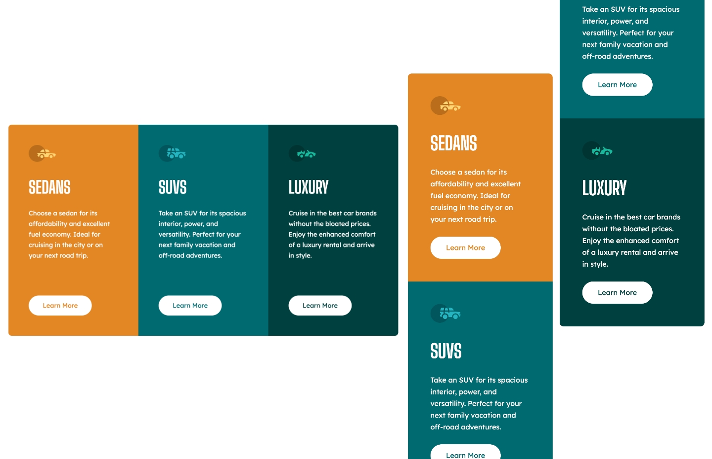

# Frontend Mentor - 3-column preview card component solution

This is a solution to the [3-column preview card component challenge on Frontend Mentor](https://www.frontendmentor.io/challenges/3column-preview-card-component-pH92eAR2-). Frontend Mentor challenges help you improve your coding skills by building realistic projects.

## Table of contents

- [Overview](#overview)
  - [The challenge](#the-challenge)
  - [Screenshot](#screenshot)
  - [Links](#links)
- [My process](#my-process)
  - [Built with](#built-with)
  - [What I learned](#what-i-learned)
  - [Continued development](#continued-development)
  - [Useful resources](#useful-resources)
- [Author](#author)
- [Acknowledgments](#acknowledgments)

## Overview

### The challenge

Users should be able to:

- View the optimal layout depending on their device's screen size
- See hover states for interactive elements

### Screenshot

### Links

- Solution URL: [Github Repository](https://github.com/jefcooper/front-end-mentor/tree/main/3-column-preview-card-component-main)
- Live Site URL: [Github Pages](https://jefcooper.github.io/front-end-mentor/3-column-preview-card-component-main/)

## My process

### Built with

- Semantic HTML5 markup
- CSS custom properties
- Flexbox
- CSS Grid
- Mobile-first workflow

### What I learned

- used a CSS variable for the card background color to enable setting the button text to background easily.
- struggled with trying to use flex-wrap until I realized that the rounded corners are impossible with dynamic wrapping.
- ultimately settled on switching flex-direction from column to row at an appropriate breakpoint.

### Continued development

### Useful resources

## Author

- Website - [Jeff Cooper](https://jefcooper.github.io)
- Frontend Mentor - [@jefcooper](https://www.frontendmentor.io/profile/jefcooper)

## Acknowledgments
