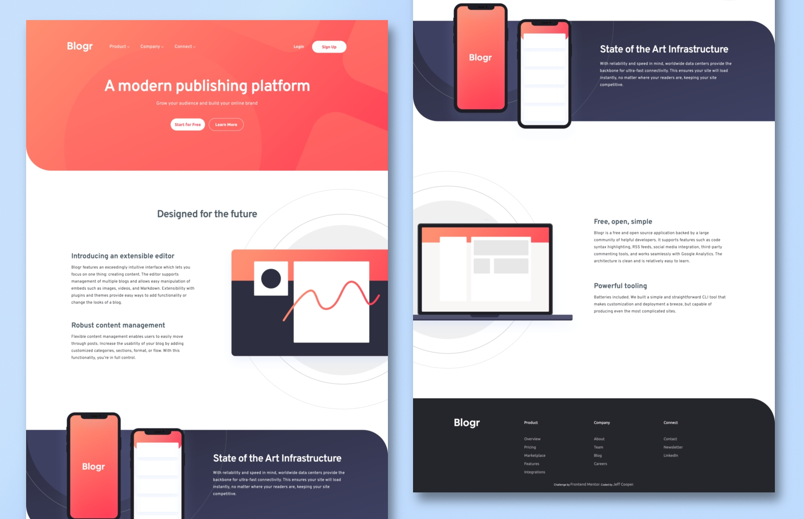
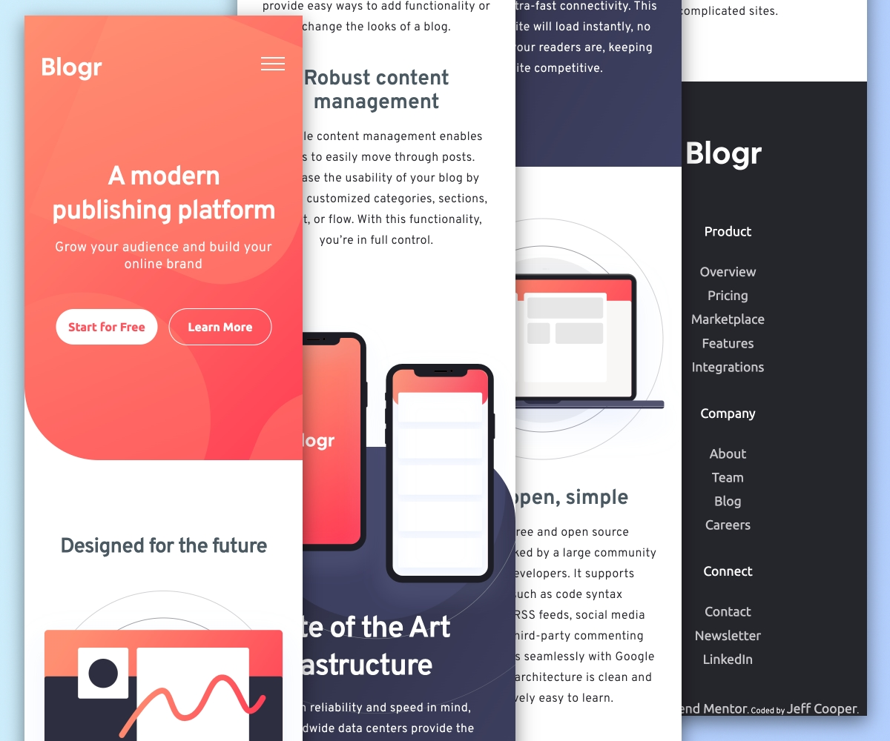

# Frontend Mentor - Blogr landing page solution

This is a solution to the [Blogr landing page challenge on Frontend Mentor](https://www.frontendmentor.io/challenges/blogr-landing-page-EX2RLAApP). Frontend Mentor challenges help you improve your coding skills by building realistic projects. 

## Table of contents

- [Overview](#overview)
  - [The challenge](#the-challenge)
  - [Screenshot](#screenshot)
  - [Links](#links)
- [My process](#my-process)
  - [Built with](#built-with)
  - [What I learned](#what-i-learned)
  - [Continued development](#continued-development)
- [Author](#author)

## Overview

### The challenge

Users should be able to:

- View the optimal layout for the site depending on their device's screen size
- See hover states for all interactive elements on the page

### Screenshot

The finished desktop version.

The finished mobile version.

### Links

- Solution URL: [Github Repository](https://github.com/jefcooper/front-end-mentor/tree/main/blogr-landing-page)
- Live Site URL: [Github Pages Site](https://jefcooper.github.io/front-end-mentor/blogr-landing-page/)

## My process

### Built with

This is a minimal toolset build.  A very small amount of javascript is used to prevent scrolling when the mobile menu is opened.  The mobile dropdown is performed using the checkbox hack using css.

- Semantic HTML5 markup
- CSS custom properties
- Flexbox
- CSS Grid
- Mobile-first workflow

### What I learned

This was a larger project that required pulling together skills from multiple other challenges including:

- positioning and layering backgrounds,
- mobile menu
- responsive design

## Author

- Website - [Jeff Cooper](https://jefcooper.github.io)
- Frontend Mentor - [@jefcooper](https://www.frontendmentor.io/profile/jefcooper)

