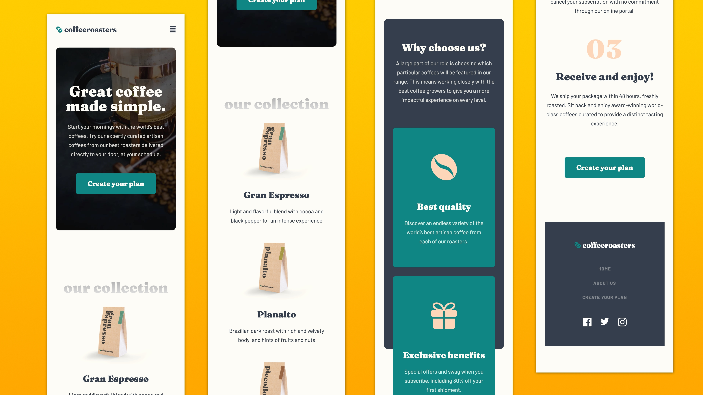
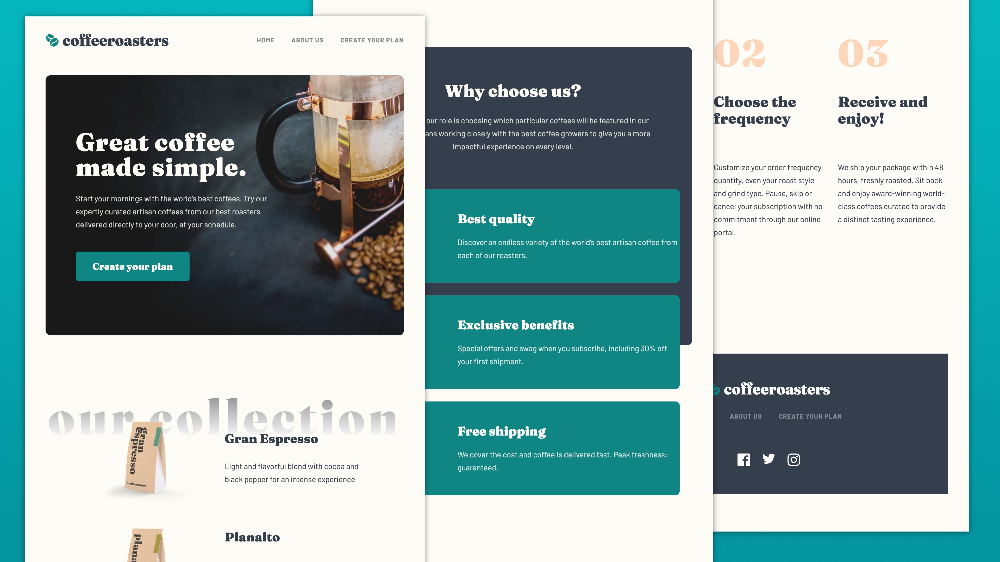

# Frontend Mentor - Coffeeroasters subscription site solution

This is a solution to the [Coffeeroasters subscription site challenge on Frontend Mentor](https://www.frontendmentor.io/challenges/coffeeroasters-subscription-site-5Fc26HVY6). Frontend Mentor challenges help you improve your coding skills by building realistic projects. 

## Table of contents

- [Overview](#overview)
  - [The challenge](#the-challenge)
  - [Screenshot](#screenshot)
  - [Links](#links)
- [My process](#my-process)
  - [Built with](#built-with)
  - [What I learned](#what-i-learned)
  - [Design Observations](#design-observations)
  - [Continued development](#continued-development)
  - [Useful resources](#useful-resources)
- [Author](#author)
- [Acknowledgments](#acknowledgments)

## Overview

### The challenge

Users should be able to:

- View the optimal layout for each page depending on their device's screen size
- See hover states for all interactive elements throughout the site
- Make selections to create a coffee subscription and see an order summary modal of their choices

### Screenshot







### Links

- Solution URL: [Github Repository](https://github.com/jefcooper/front-end-mentor/tree/main/coffeeroasters-subscription-site)
- Live Site URL: [Github Pages Site](https://jefcooper.github.io/front-end-mentor/coffeeroasters-subscription-site/)

## My process

### Built with

- Semantic HTML5 markup
- CSS custom properties
- Flexbox
- CSS Grid
- Mobile-first workflow

### What I learned

This is a larger challenge than others I have completed.  Time, task management and motivation to finish all become factors.

The Technical

- Ball and Line illustration went through multiple iterations before landing on a pure CSS solution separating the balls from the line as background element.  The deciding factor was aligning the balls to the grid.  To do this the balls needed to be inside grid cells.  The background line, likewise had to be aligned across multiple grid cells underneath the same cells as the balls.

- The dark backgrounds in the plan and about pages presented subtle challenges.  The bitmaps fade slightly from left-to-right such that a background repeat shows a line.  background: cover was needed to prevent this.

- Fraunces 9pt is used as the display font in the Figma design.  This is not one of the built-in Figma fonts (at least not on the Mac version), but Fraunces Black is.  The 9pt variant is ever so slightly different and yields width differences.  This led to the addition of letter-spacing on nearly every heading to match the original design.

- Changing the text of the order was done by setting the innerHTML of the heading or span node as required.  I didn't use any frameworks for this, although in times past I've used jquery, but it seemed heavy since I didn't have much DOM manipulation to do here, so kept it to pure JS.

- svg images were altered for social icons, and logo.  Used vercel's svg sprite site (https://svg-sprite-generator.vercel.app/) to create a single svg file where fill can be overridden in css.

- the logo svg required manual intervention because simply removing all fill removes the green of the beans.  For this I used a CSS variable to add a replacable color with override variable.

```css
fill="var(--_clr-green, hsl(179, 81%, 29%))" 
```

- CSS variables were also used for a configurable container class.  This allowed for easily modifying the margin for different breakpoints as required by the design.

```css
.container {
  --_container-margin: 1.5rem; /* mobile is default */
  --_container-max-width: 1280px; /* desktop max width */

  max-width: var(--_container-max-width);
  margin-inline: max(
    50vw - var(--_container-max-width) / 2,
    var(--_container-margin)
  );
}
```

- Accessibility (A11y) was especially challenging.  This design uses many accessibility anti-patterns that make it difficult.  Accordions that serve no direct purpose other than to hide selections and add extra steps when using a screen reader and a pop-up modal dialog for order confirmation all provided roadblocks.
- For the accordions, @Grace pointed me to attaching the aria-expanded to buttons and suggested the options should be radio buttons.  From there I reworked the html to have semantic meaning and got the accordions and options keyboard navigable.
- For the dialog, it was a longer journey.  After researching it for a while and learning the correct patterns for accessible dialogs I ended up using a javascript library https://a11y-dialog.netlify.app/.  This library handles the focus switching when launching the dialog and dismissing it along with focus trapping when tabbing between elements within the dialog.
- In order to use the a11y-dialog library, I needed to learn a little about ES6 module usage from html.  The a11y-dialog library is packaged for import as a module.  However,  HTML script references do not handle modules by default and the ```type='module'``` flag is needed on the script import to make it function.

```html
<script 
	type="module" 
	src="https://cdn.jsdelivr.net/npm/a11y-dialog@7/dist/a11y-dialog.min.js"
></script>
```

### Design Observations

1. The Order Confirmation modal dialog lacks a way to cancel.  I added a close button to the top right since the text of the box refers to cancelling and adding a whole second button disrupted the look too much.
2. The Order box in the plan page for desktop lacks rounded corners where all other breakpoints have rounded corners.  I gave the desktop version rounded corners for consistency.
3. The display font is Fraunces 9pt.  In Figma, this font is not available by default and it is not available easily on Google Fonts.  For this reason I used Fraunces, Black and added letter-spacing to approximate the look of Fraunces 9pt.

### Continued development


### Useful resources

https://www.w3.org/WAI/ARIA/apg/example-index/accordion/accordion

Gives detail on how WAI expects an accordion to be implemented for accessibility.  Of particular note, is that the aria-expanded attribute is not used in this example to control the visibility of the accordion content, but instead a separate attribute is added in JS to the content area when the aria-expanded attribute is set.

Accessible Modal Dialogs

[YouTube Rob Dodson, A11ycast #19](https://youtu.be/JS68faEUduk)

Accessible Modal Dialog Library, (Kitty Giraudel)

[Documentation a11y-dialog](https://a11y-dialog.netlify.app/)

[Github a11y-dialog](https://github.com/KittyGiraudel/a11y-dialog)

[Inert Polyfill Github](https://github.com/WICG/inert)

When to use which landmark semantic element.  This helped me decide to use an aside instead of nav on the plan steps.
[Good flowchart to decide on aside vs nav etc.](https://superdevresources.com/section-article-nav-aside-html5/)

## Author

- Website - [Jeff Cooper](https://jefcooper.github.io)
- Frontend Mentor - [@jefcooper](https://www.frontendmentor.io/profile/jefcooper)


