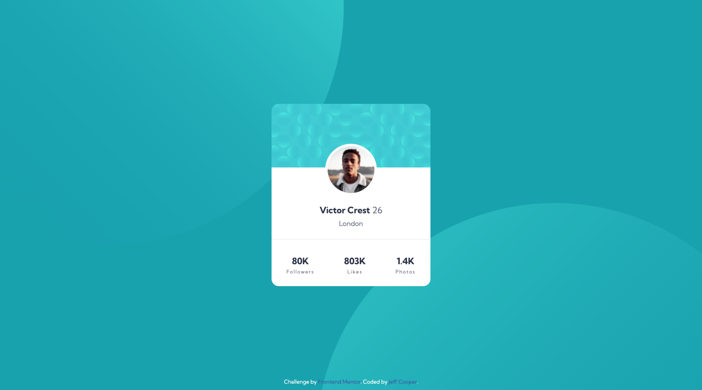
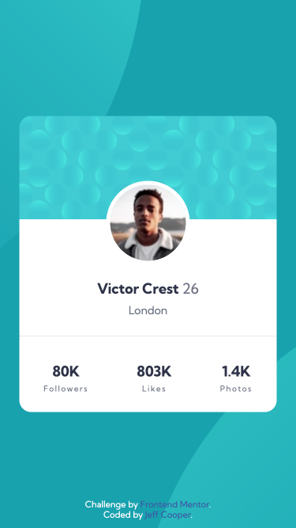

# Frontend Mentor - Profile card component solution

This is a solution to the [Profile card component challenge on Frontend Mentor](https://www.frontendmentor.io/challenges/profile-card-component-cfArpWshJ). Frontend Mentor challenges help you improve your coding skills by building realistic projects.

## Table of contents

- [Overview](#overview)
  - [The challenge](#the-challenge)
  - [Screenshot](#screenshot)
  - [Links](#links)
- [My process](#my-process)
  - [Built with](#built-with)
  - [What I learned](#what-i-learned)
  - [Continued development](#continued-development)
  - [Useful resources](#useful-resources)
- [Author](#author)
- [Acknowledgments](#acknowledgments)

## Overview

### The challenge

- Build out the project to the designs provided

### Screenshot




### Links

- Solution URL: [Github Repository](https://github.com/jefcooper/front-end-mentor/tree/main/profile-card-component-main)
- Live Site URL: [Github Pages](https://jefcooper.github.io/front-end-mentor/profile-card-component-main/)

## My process

### Built with

- Semantic HTML5 markup
- CSS custom properties
- Flexbox
- CSS Grid
- Mobile-first workflow

### What I learned

Note that the desktop and mobile designs are slightly different widths. I coded for the mobile width only because having the difference in desktop did not add visually to the design but adds unnecessary complexity.

I used CSS variables within the card for positioning the image at the background break. CSS variables allowed for calc to adjust the margin appropriately.

```CSS
.card {
  --card-background-height: 140px;
  --picture-width: 96px;
  --picture-outline: 5px;
  ...
}
.card__picture {
  width: var(--picture-width);
  border-radius: 50%;
  outline: var(--picture-outline) solid var(--color-neutral-100);

  /* calculate top margin based on card background and image sizes */
  margin-top: calc(
    var(--card-background-height) - var(--picture-width) / 2 -
      var(--picture-outline)
  );
}

```

Positioning the background circles took a while.  Learned from another solution to use vw/vh on background-position to get the offset correct.

```CSS
body {
	...
	background-image: 
		url(images/bg-pattern-top.svg),
		url(images/bg-pattern-bottom.svg);
	background-position: right 51vw bottom 37vh, 45vw 52vh;
	background-repeat: no-repeat, no-repeat;
}
```
Prior to this, I had tried negative offsets from the left and top.  These both failed miserably. The trick seems to be offseting in vw and avoiding negative offsets.

### Continued development

### Useful resources

## Author

- Website - [Jeff Cooper](https://jefcooper.github.io)
- Frontend Mentor - [@jefcooper](https://www.frontendmentor.io/profile/jefcooper)

## Acknowledgments
