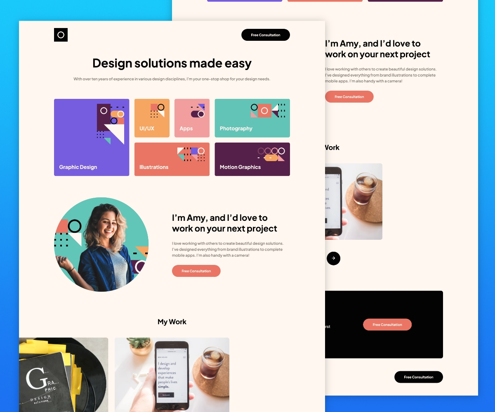
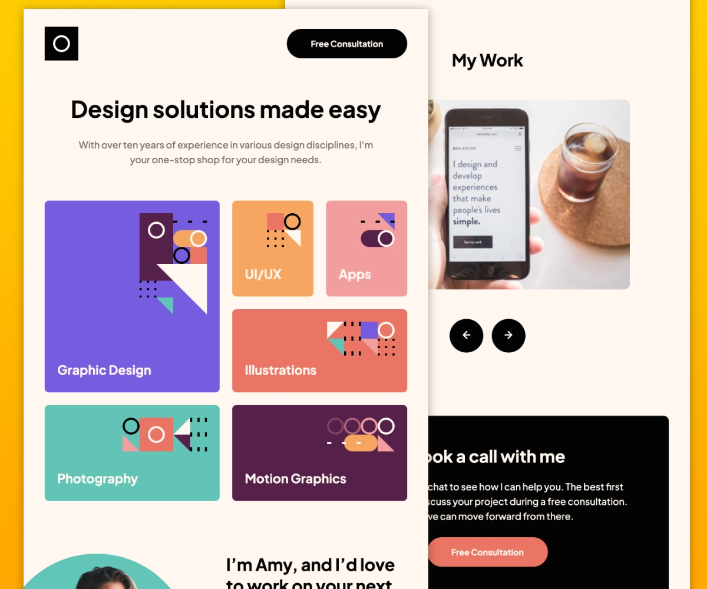
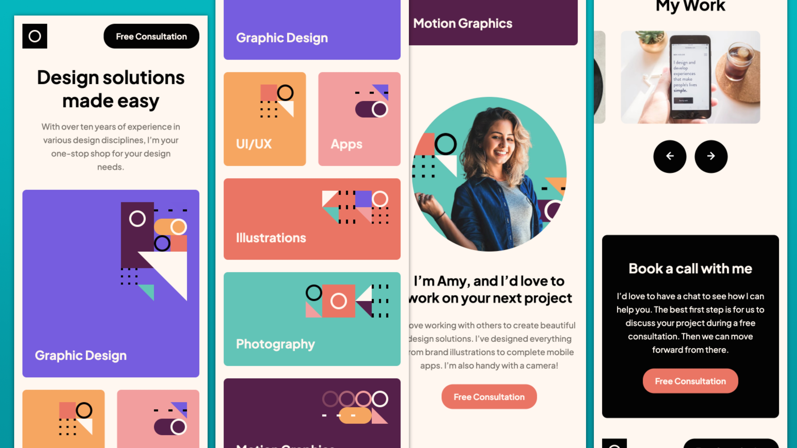

# Frontend Mentor - Blogr landing page solution

This is a solution to the [Single-page Design Portfolio challenge on Frontend Mentor](https://www.frontendmentor.io/challenges/singlepage-design-portfolio-2MMhyhfKVo). Frontend Mentor challenges help you improve your coding skills by building realistic projects.

## Table of contents

- [Overview](#overview)
  - [The challenge](#the-challenge)
  - [Screenshot](#screenshot)
  - [Links](#links)
- [My process](#my-process)
  - [Built with](#built-with)
  - [What I learned](#what-i-learned)
  - [Continued development](#continued-development)
- [Author](#author)

## Overview

### The challenge

Users should be able to:

- View the optimal layout for the site depending on their device's screen size
- See hover states for all interactive elements on the page

### Screenshot

The finished desktop version.



The finished tablet version.



The finished mobile version.



### Links

- Solution URL: [Github Repository](https://github.com/jefcooper/front-end-mentor/tree/main/single-page-design-portfolio)
- Live Site URL: [Github Pages Site](https://github.com/jefcooper/front-end-mentor/tree/main/blogr-landing-page)

## My process

### Built with

This is a minimal toolset build. A very small amount of javascript is used to prevent scrolling when the mobile menu is opened. The mobile dropdown is performed using the checkbox hack using css.

- Semantic HTML5 markup
- CSS custom properties
- Flexbox
- CSS Grid
- Mobile-first workflow

### What I learned

This project provided an incremental layout challenge in the Amy photo, portfolio section. I learned how to correctly offset the image to the left with negative margin to make room for the text block with min-width at smaller screen width.

```css
.portfolio {
  /* pad right as if it's centering in a 1110px container */
  margin-right: max(2.5rem, 50vw - 555px);

  /* pad left so at desktop it's same as right, but smaller we get negative
       offset to make space for text block to right */
  margin-left: max(min(2.5rem, 100vw - 812px), 50vw - 555px);
  ...;
}
```

The carousel is created using the newer CSS scrollbar features.

```css
.carousel__strip {
  /* snap scrolling with touch or programmatic with buttons */
  overflow: scroll;
  scroll-snap-type: inline mandatory; /* enable horizontal snapping on items */
  overscroll-behavior: inline contain; /* prevent bounce at end of scroll */
  scrollbar-width: none; /* hide scrollbar on Firefox */
}
.carousel__strip::-webkit-scrollbar {
  /* hide scrollbar on webkit browsers */
  display: none;
}
.carousel__strip img {
  scroll-snap-align: center;
}
```

Note that the left/right buttons simply use scrollBy in javascript to move left/right enough to snap to next image.

```javascript
carousel__strip.scrollBy({ left: -100, behavior: "smooth" });
```

Reference: YouTube Kevin Powell https://youtu.be/3yfswsnD2sw

## Author

- Website - [Jeff Cooper](https://jefcooper.github.io)
- Frontend Mentor - [@jefcooper](https://www.frontendmentor.io/profile/jefcooper)
