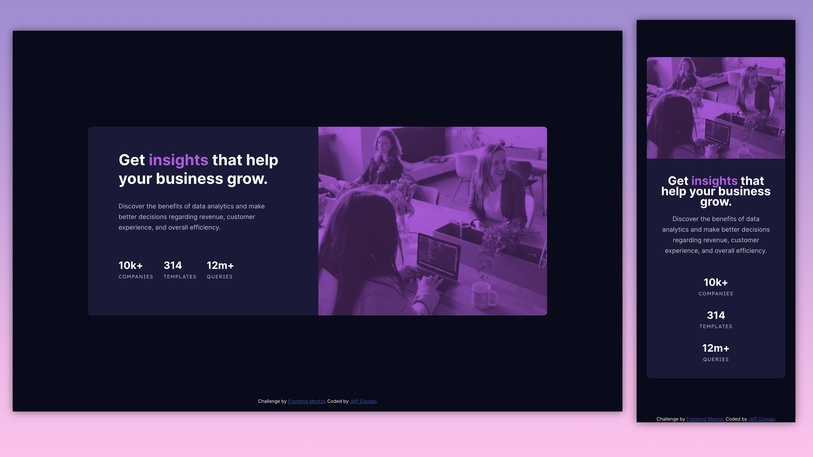

# Frontend Mentor - Stats preview card component solution

This is a solution to the [Stats preview card component challenge on Frontend Mentor](https://www.frontendmentor.io/challenges/stats-preview-card-component-8JqbgoU62). Frontend Mentor challenges help you improve your coding skills by building realistic projects.

## Table of contents

- [Overview](#overview)
  - [The challenge](#the-challenge)
  - [Screenshot](#screenshot)
  - [Links](#links)
- [My process](#my-process)
  - [Built with](#built-with)
  - [What I learned](#what-i-learned)
  - [Continued development](#continued-development)
  - [Useful resources](#useful-resources)
- [Author](#author)
- [Acknowledgments](#acknowledgments)

## Overview

### The challenge

Users should be able to:

- View the optimal layout depending on their device's screen size

### Screenshot

### Links

- Solution URL: [Add solution URL here](https://github.com/jefcooper/front-end-mentor/tree/main/stats-preview-card-component-main)
- Live Site URL: [Add live site URL here](https://jefcooper.github.io/front-end-mentor/stats-preview-card-main)

### Built with

- Semantic HTML5 markup
- CSS custom properties
- Flexbox
- CSS Grid
- Mobile-first workflow

### What I learned

From actually doing the challenge, I learned that I didn't fully understand how the colorization effect used by the designer was done.  I thought I had it in a codepen, but when I tried it out here, it was too dark.  Turns out the image has 70% opacity and the color background is 100% opaque.  In the end I got the color match exact.

### Useful resources

#### Codepen

- https://codepen.io/jefcooper/pen/LYBZZBj

## Author

- Website - [Jeff Cooper](https://jefcooper.github.io)
- Frontend Mentor - [@jefcooper](https://www.frontendmentor.io/profile/jefcooper)

## Acknowledgments
