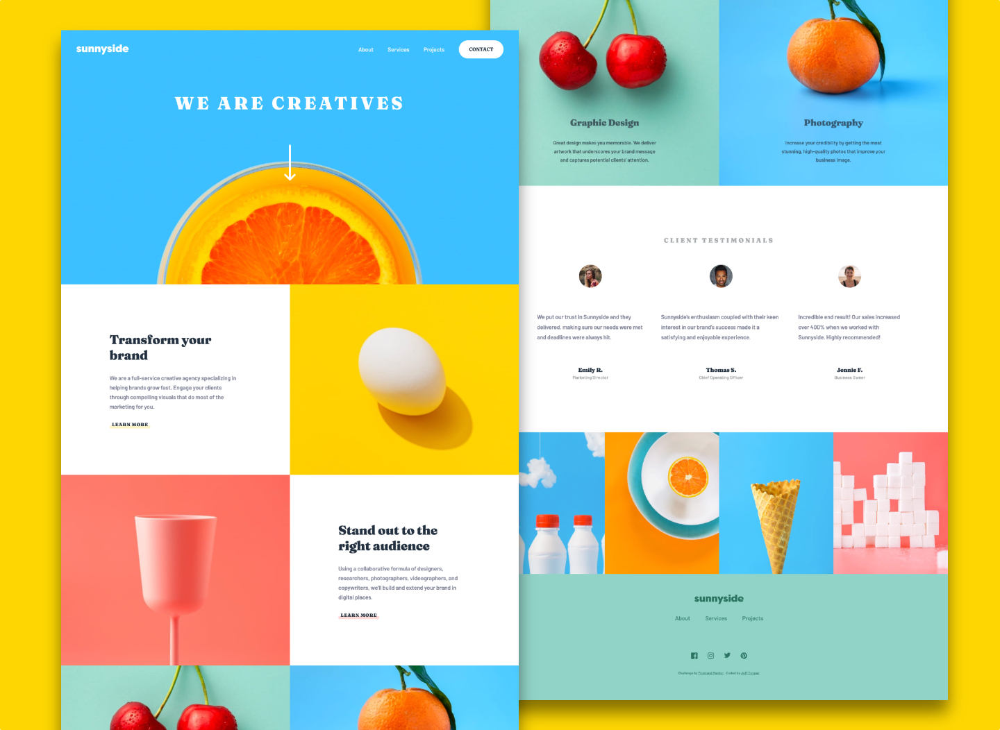
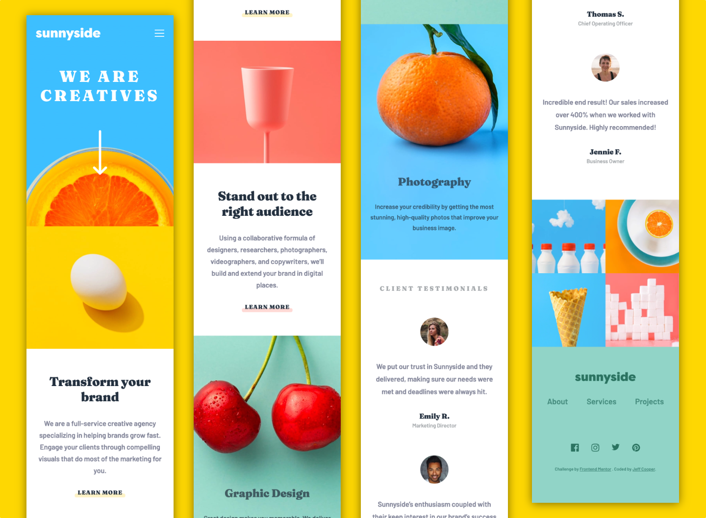

# Frontend Mentor - Sunnyside agency landing page solution

This is a solution to the [Sunnyside agency landing page challenge on Frontend Mentor](https://www.frontendmentor.io/challenges/sunnyside-agency-landing-page-7yVs3B6ef). Frontend Mentor challenges help you improve your coding skills by building realistic projects.

## Table of contents

- [Overview](#overview)
  - [The challenge](#the-challenge)
  - [Screenshot](#screenshot)
  - [Links](#links)
- [My process](#my-process)
  - [Built with](#built-with)
  - [What I learned](#what-i-learned)
  - [Continued development](#continued-development)
- [Author](#author)

## Overview

### The challenge

Users should be able to:

- View the optimal layout for the site depending on their device's screen size
- See hover states for all interactive elements on the page

### Screenshot

The finished desktop version.



The finished mobile version.



### Links

- Solution URL: [Github Repository](https://github.com/jefcooper/front-end-mentor/tree/main/sunnyside-agency-landing-page)
- Live Site URL: [Github Pages Site](https://jefcooper.github.io/front-end-mentor/sunnyside-agency-landing-page/index.html)

## My process

### Built with

This is a minimal toolset build.  A very small amount of javascript is used to prevent scrolling when the mobile menu is opened.  The mobile dropdown is performed using the checkbox hack using css.

- Semantic HTML5 markup
- CSS custom properties
- Flexbox
- CSS Grid
- Mobile-first workflow

### What I learned

Learned how to prevent scrolling while the mobile menu is opened by adding a .modal class to the HTML body on click in js and then styling the .modal class to set overflow: hidden.


```html
<input
	type="checkbox"
	id="header-nav__toggle"
	class="header-nav__toggle"
	onclick="toggleModal(this);"
/>

<div class="header-nav__backdrop" onclick="toggleModal()">
  <nav class="header-nav">
    <div class="header-nav__decoration"></div>
    <ul>
    ...
    </ul>
  </nav>
</div>
```

Note that the HTML also provides a backdrop div that closes the menu when click outside the menu.

```css
.modal {
	overflow: hidden;
}
```

This simple .modal class is the same technique used in frameworks like Bootstrap.

```js
const toggleModal = (el) => {
  const inputEl = document.getElementById("header-nav__toggle");
  if (!!el) {
    document.body.classList.add("modal");
  } else {
    document.body.classList.remove("modal");
    inputEl.checked = false;
  }
};
```
Note that the javascript code also sets the `checked` state of the input element to false when clicked outside since the input label is not used and will not by itself toggle the checked state.

### Continued development

This is my first submission, but not my first project.  I found that after subscribing to Pro and getting access to the figma file, that it was much easier to get close to pixel perfect.  Before that, I struggled to match fonts and colors.  The Figma version has minor differences in color and the fonts all had custom letter-spacing that would have been impossible to match by eye alone.

## Author

- Website - [Jeff Cooper](https://jefcooper.github.io)
- Frontend Mentor - [@jefcooper](https://www.frontendmentor.io/profile/jefcooper)

